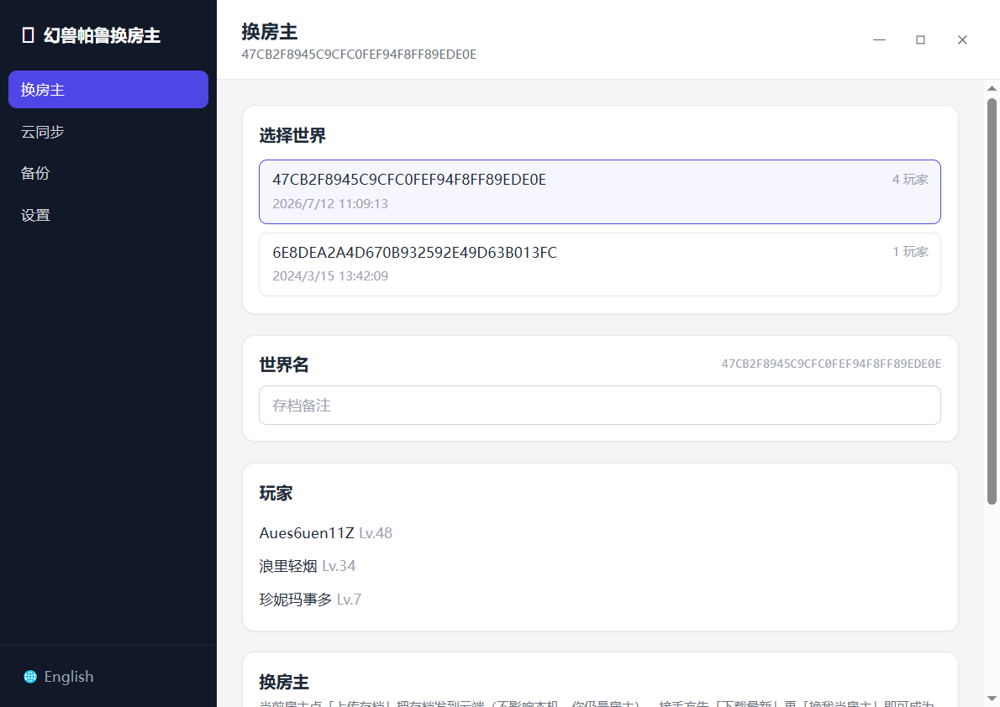

# Palworld Host Swap

[中文](README.md) | **English**

  

> A desktop tool for **swapping the host** of a Palworld co-op save. Lets multiple players take turns being the host while sharing one world's progress. **Single-file exe, zero install.**



---

## Download

Grab `palworld-save-relay.exe` from the [Releases](https://github.com/Aues6uen11Z/palworld-save-relay/releases) page and double-click to run. No installation, no runtime setup.

> On first launch it auto-detects your Palworld save directory (`%LocalAppData%\Pal\Saved\SaveGames`).

## Usage

Pick a world on the **Host Swap** page, then choose one of two methods:

### Method 1: Cloud Sync (recommended)

1. **(first time only)** Go to **Settings** and configure Qiniu Kodo: enter AccessKey / SecretKey / Bucket. Region is auto-detected; leave download domain blank for auto.
2. **Current host**: click **⬆ Upload Save** -- your local save is untouched, you remain host.
3. **Person taking over**: click **⬇ Download Latest**, then **🎯 Take Over as Host**, and launch the game.

### Method 2: Manual Transfer (no cloud needed)

1. **Host**: click **📤 Export Save**, pick where to save the single file, send it to the other person.
2. **Person taking over**: click **📥 Import Save**, select the received file, automatically become the new host, and launch the game.

> A local backup is made automatically before every upload / download / import / host swap. You can roll back anytime from the **Backups** page.

## Features

- Auto-detects the local host save, lists worlds / players, identifies the host by UID
- One-click host swap (SteamID -> UID via cityhash64)
- Cloud sync: upload / download / version history via Qiniu Kodo
- Manual import / export: single-file relay, no cloud dependency
- Local backup management with one-click restore
- Bilingual UI (中文 / English), one-click toggle
- Full-chain logging (`%AppData%\PalSaveRelay\app.log`)
- Single Windows exe (Oodle DLL embedded), zero install

## How It Works

> Skip this if you just want to use the tool -- follow **Usage** above.

In co-op mode the save lives only on the host's machine; when the host goes offline nobody else can continue. This tool swaps the host by converting the host UID and relaying the save through the cloud or a file.

Inside the save, the host's own UID is the sentinel `00000000-0000-0000-0000-000000000001`; everyone else (guests) has a real UID derived from their SteamID (`cityhash64`).

- **Intermediate state**: replace the host sentinel `0000…0001` with the host's real UID, yielding "everyone is a real UID, nobody is the host" -- this is the transfer format.
- **Upload / Export**: the conversion runs on a **temporary copy** that is then packaged -- **your local save is untouched** (you remain host after uploading).
- **Download / Import**: overwrite your local save with the intermediate state (after backing up), then swap your real UID to `0000…0001`, making you the new host.

The core operation ConvertHost(fromUID -> toUID) is a **one-way global UID replacement** (not a two-way swap), combined with the intermediate state to achieve host-swapping. Each person's save data always stays under their own real UID and is never lost across transfers.

> LocalData.sav holds personal quest / map progress and is local -- it is **not transferred** with the world; each person keeps their own. Local backups do include it for a complete rollback.

## Build From Source

Requires Go 1.25+, Node.js, [Wails v3 CLI](https://wails.io), mingw-w64 gcc (go-oodle depends on CGO).

```powershell
.\build.ps1            # one-shot: frontend + icons + syso + go build -> palworld-save-relay.exe
```

Or manually:

```bash
cd frontend && npm install && npm run build && cd ..
go build -o palworld-save-relay.exe .
```

> `@wailsio/runtime` tracks the Wails version -- don't pin an old version manually, or the front/back-end protocol will mismatch and report "Invalid runtime call".

## Development

```bash
wails3 dev                 # hot-reload dev
go test ./internal/...     # backend tests (incl. real save round-trip)
```

Project structure:

```
internal/
  sav/        Save engine (ported from cheahjs/palworld-save-tools)
  palworld/   Domain logic: detect, ConvertHost, SteamID->UID, backup, packaging
  storage/    Cloud storage abstraction + Qiniu implementation
  config/     App config
  logger/     Process-level file logger
frontend/     React UI (bilingual i18n)
```

Test fixtures are real Palworld saves (covering both PlZ/zlib and PlM/Oodle), gitignored for privacy. To fetch them on first run:

```powershell
cd internal/sav/testdata; ./fetch.ps1
```

## Known Limitations

- The host's real UID may already exist in the save (e.g. OldOwnerPlayerUIds). A single "handoff" can create duplicate references -- **this does not affect host-swapping**.
- Guild `individual_character_handle_ids` guids are not currently included in the replacement; patch if guild-member ownership issues are observed.
- Upload / export only touch a temporary copy and never modify your local save; download / import overwrite the local world (after backup); Take Over as Host modifies the local save (after backup).

## Acknowledgements

- [cheahjs/palworld-save-tools](https://github.com/cheahjs/palworld-save-tools) - upstream save format parsing (SAV/GVAS/property system).
- [deafdudecomputers/PalworldSaveTools](https://github.com/deafdudecomputers/PalworldSaveTools) - reference for host swapping & guild/character parsing.
- [new-world-tools/go-oodle](https://github.com/new-world-tools/go-oodle) - Go Oodle bindings.

## License

MIT